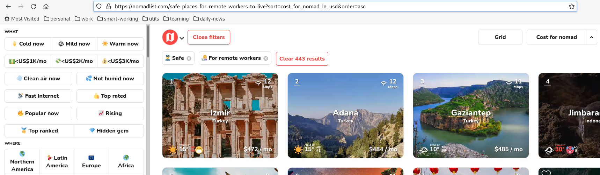

# Gypsylist

**gypsylist.py** is a web scraper for [nomadlist.com](nomadlist.com), made to avoid website restrictions.

[nomadlist.com](nomadlist.com) is a website with a lot of information for digital nomad people, to find the best places to live and work remotely as a location independent remote worker. Unfortunately most of these contents are restricted if you are not member of this website.

This script doesn't cover all of the information retrievable from the website, but it's just an entry point to evaluate this without to sign up.

## Installation

Before to use **gypsylist** you have to install some requirements:

```bash
pip3 install -r requirements.txt
```

Additionally, having **selenium** as dependency, you have also to setup the browser driver. To install this, please, take a look here: https://www.selenium.dev/documentation/webdriver/getting_started/install_drivers/.

Now you should be ready to run the script.

## Usage

To use **gypsylist**, at first, browse the [nomadlist.com](nomadlist.com) website and apply the filters you need to do your research. Now, get the url path from the address bar of your browser (as shown below):



And use this to scrape with **gypsylist**:

```bash
./gypsylist.py --path "safe-places-for-remote-workers-to-live?sort=cost_for_nomad_in_usd&order=asc" --emoji
```

This is going to be the expected result:

```
#1
🏙️  city: Lisbon
🌎 country: Portugal
⭐️ overall: 4/5
💵 cost: 4/5
📡 internet: 5/5
😀 fun: 5/5
👮 safety: 4/5

...

#440
🏙️  city: Zurich
🌎 country: Switzerland
⭐️ overall: 3/5
💵 cost: 1/5
📡 internet: 5/5
😀 fun: 4/5
👮 safety: 4/5

#441
🏙️  city: Leiden
🌎 country: Netherlands
⭐️ overall: 3/5
💵 cost: 1/5
📡 internet: 5/5
😀 fun: 4/5
👮 safety: 4/5

#442
🏙️  city: Honolulu, Hawaii
🌎 country: United States
⭐️ overall: 4/5
💵 cost: 1/5
📡 internet: 5/5
😀 fun: 5/5
👮 safety: 4/5

#443
🏙️  city: Lake Tahoe, CA
🌎 country: United States
⭐️ overall: 3/5
💵 cost: 1/5
📡 internet: 5/5
😀 fun: 4/5
👮 safety: 4/5
```

(Always remember `--emoji`). Have fun!

## Known Issues

This is not what you can call "a well written code" (sorry Gods of programming for this). For this reason there are several code smell or bugs that are not under review (due to the short time I dedicated to write the script).

* Using `--headless / -H` parameter to set the browser in `headless` mode, you will retrieve just the first page contents from the website.

